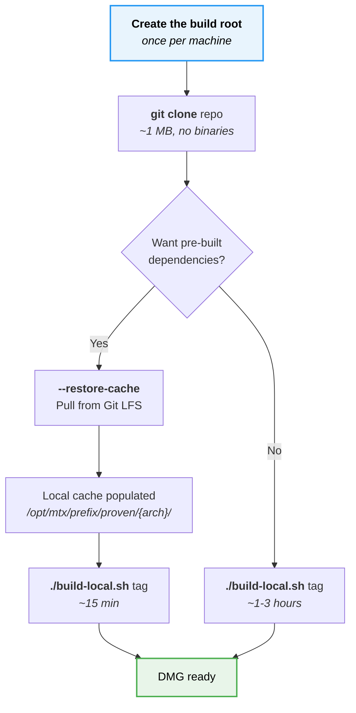
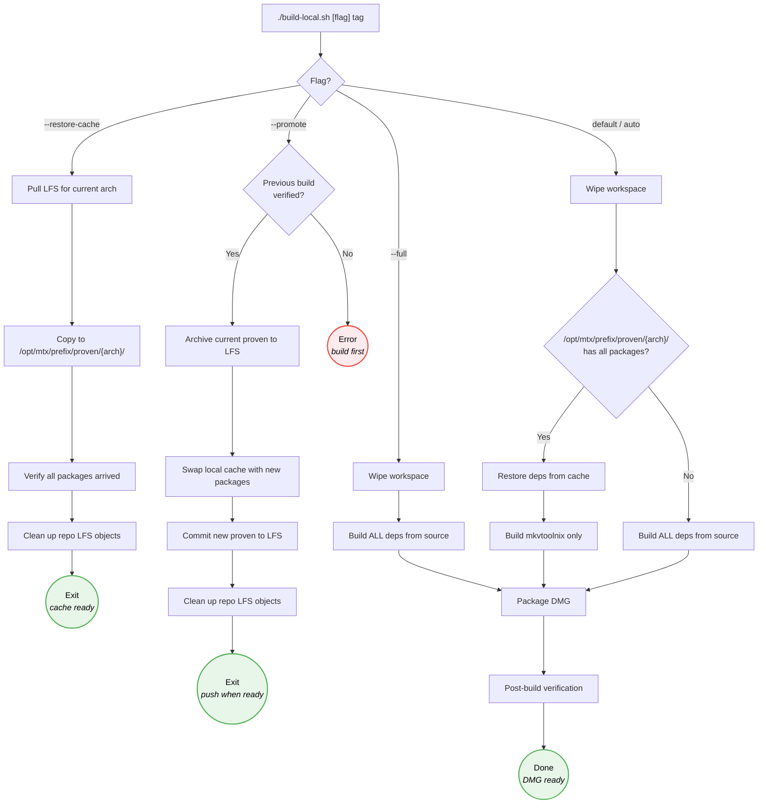
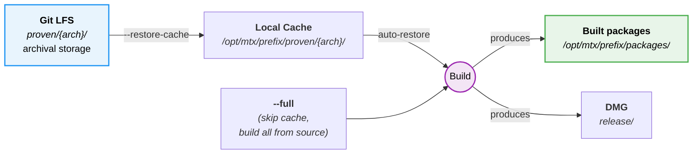
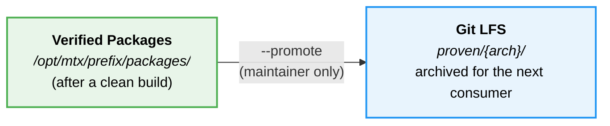
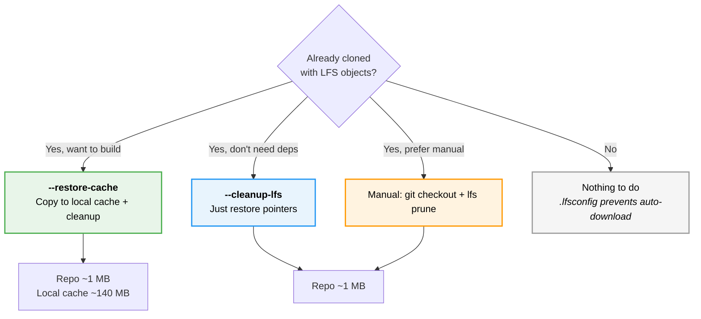

# Build Workflow

## Quick Reference

| Flag | Purpose | Who | Build time | Requires |
|------|---------|-----|-----------|----------|
| *(default)* | Validate the cache against the tag, then restore it; full build if the cache is absent | Anyone | 15 min (cached) / 1-3 hrs (full) | Tag |
| `tools/refresh-deps.sh` | Rebuild only the dependencies that no longer match the tag | Anyone | minutes to hours, depending on which | Tag |
| `--restore-cache` | Pull pre-built deps from LFS to local cache; refuses a cache missing either sidecar | Anyone | ~2 min | Nothing |
| `--full` | Rebuild all dependencies from source | Anyone | 1-3 hours | Tag |
| `--promote` | Archive verified build to LFS | Maintainer | ~1 min | Verified build |
| `--cleanup-lfs` | Restore proven/ to pointers, prune LFS cache | Anyone | ~10 sec | Nothing |
| `tools/audit-proven-cache.sh` | Check the cache committed to the repo is usable by whoever restores it | Maintainer | ~1 sec | Nothing |

## First-Time Setup

The build installs into a fixed root rather than your home directory, so the
paths recorded by compilers are the same on every machine. `/opt` is
root-owned, so the root is created once per machine before anything else:

```sh
sudo mkdir -p /opt/mtx && sudo chown "$(id -un)" /opt/mtx
```

`MTX_ROOT` relocates the whole tree if you would rather build somewhere you
already own — it is the only knob, and the prefix, workspace, packages and
staging all derive from it.

Then choose your path based on whether you want to use pre-built dependencies or compile everything yourself.



## Build Mode Decision Tree

What happens inside the build script depending on the flag you pass.

> Before any of these modes runs, the build script verifies the upstream release tag's GPG signature against the pinned mbunkus key, and SHA256-verifies each package on cache restore. See [trust-model.md](trust-model.md) for the verification chain.



## Dependency Lifecycle

How dependencies flow between Git LFS, the local cache, and the build system. There are two halves: a **consumer path** that everyone uses, and a **promotion path** that's maintainer-only.

### Consumer path (everyone)



Most users only ever do this: pull dependencies from LFS into the local cache (or skip the cache with `--full` and build everything from source), run a build, get a DMG.

### Promotion path (maintainer only)



After a verified build, the maintainer archives the new packages back to LFS so the next person to run `--restore-cache` picks them up. This is a separate operation, not part of the build itself.

> **The two halves form a loop in time, not space:** today's `--promote` becomes tomorrow's `--restore-cache` for the next person to clone fresh.

## Existing Clones (Reclaiming Disk Space)

If you cloned the repo before `.lfsconfig` was added, or cloned with `git lfs pull`, the `proven/` directory contains full binary files (~264 MB) and `.git/lfs/objects/` holds another copy (~270 MB). Here's how to reclaim that space.

### Option A: Keep deps for building, clean up repo (recommended)

Use `--restore-cache` to copy the already-downloaded binaries to your local build cache, then clean up the repo:

```sh
./build-local.sh --restore-cache
```

This copies the deps to `/opt/mtx/prefix/proven/{arch}/`, restores `proven/` to pointer files, and prunes the LFS cache. Repo drops from ~535 MB to ~1 MB. Future builds use the local cache.

### Option B: Just reclaim space (no build planned)

If you don't need the dependencies at all:

```sh
./build-local.sh --cleanup-lfs
```

This restores `proven/` to pointer files and prunes the LFS cache. No files are copied anywhere.

### Option C: Manual cleanup (no script)

If you prefer to handle it yourself:

```sh
# Step 1: Restore proven/ files to LFS pointers
# GIT_LFS_SKIP_SMUDGE prevents checkout from re-downloading the real files
GIT_LFS_SKIP_SMUDGE=1 git checkout -- proven/

# Step 2: Verify files are now pointers (should be ~130 bytes each)
wc -c proven/arm/*.tar.gz | tail -1

# Step 3: Prune the LFS object cache (removes downloaded objects no longer
# referenced by the working copy)
git lfs prune

# Step 4: Verify space reclaimed
du -sh .git/lfs/objects/   # should be ~0 bytes
du -sh .                   # should be ~1 MB total
```

After any of these options, future `git pull` will not re-download LFS objects thanks to `.lfsconfig`.



## When the cache no longer matches the tag

Each cached dependency carries a `.manifest.json` recording three things about how it was
built: the source tarball, taken from that release's `specs.sh`; the patch set applied to that
source; and the prefix it was installed under. Before restoring anything, a build compares all
three against the tree it is building, and refuses the package if any differs.

A version bump was always caught, because the version is part of the cache filename and the file
simply goes missing. What the manifest adds is the case the filename cannot express: **same
version, different content** — a source tarball that hashes differently, or a package promoted by
something other than a release build.

On a mismatch the build names the offending packages and stops. It does not fall back to a full
rebuild, because a cache that contradicts the tag is a question for a person rather than
something to paper over with three hours of compiling.

```sh
./tools/refresh-deps.sh release-XX.0 --dry-run   # what drifted, and why
./tools/refresh-deps.sh release-XX.0             # rebuild only those
./build-local.sh release-XX.0                    # normal build, ~15 min
```

`refresh-deps.sh` restores the dependencies that are still current, rebuilds the ones that are
not — in upstream's own build order — and repromotes just those into the local cache. Everything
else is left alone. The repo's LFS copy is untouched until you run `--promote` after a verified
build.

One field, `configure_args_hash`, is reported when it drifts but never refuses. It is an
approximation: derived from the text of Qt's configure arguments, so blind to compiler, SDK and
deployment-target changes, and it exists for Qt alone. The three that decide are the source hash,
the patch state and the prefix — `patch_state_hash` is recorded for every dependency (`"none"`
where a dependency has no patches) and a mismatch refuses, which is what caught a Qt built
without its patch set.

## Build Numbers

Each build increments a per-architecture counter. As of 2026-05-06, production and experimental builds use separate counters:

- Production (release-track) builds: `.build-counter-arm-rel`, `.build-counter-intel-rel`
- Experimental builds (`tools/build-exp.sh`): `.build-counter-arm-exp`, `.build-counter-intel-exp`

These files are **tracked in git on purpose**, so the counter persists across machines. If you build on your desktop (counter reaches 13) then push, a subsequent build on your laptop continues from 14 instead of restarting at 1. Build numbers appear in internal DMG filenames:

- Production: `MKVToolNix-{ver}-{arch}-rel{NNN}-{branch}.dmg`
- Experimental: `MKVToolNix-{ver}-{arch}-exp{NNN}-{slug}-{hash}.dmg`

This correlates binaries with entries in `build-report-{tag}.txt`, which helps when diagnosing failures across machines. Builds before 2026-05-06 used a single combined `.build-counter-{arm,intel}` with a `b{NNN}` prefix; pre-rename DMGs in `build/` retain those filenames as historical record.

### Resetting the counter

If you cloned this repo for your own use and want to start build numbering fresh on a new machine, delete the relevant counter files before your first build:

```sh
rm .build-counter-arm-rel .build-counter-intel-rel
rm .build-counter-arm-exp .build-counter-intel-exp
# or just the ones for your architecture and build type
```

The counter then restarts at 1 and increments locally from there. **Do not push resets back to this repo** — doing so would collide with the maintainer's build numbering.

## Experimental Builds

`tools/build-exp.sh` compiles MKVToolNix from something other than a signed release: a worktree
with a fix in progress, or an upstream commit with named changes applied. Its DMGs are for testing
and comparison. They go to `build/` as `MKVToolNix-{next}pre-{arch}-exp{NNN}-{slug}-{hash}.dmg`
(`{next}` is the source's major version plus one), never to `release/`, each with a `.sha256` and
a schema-2 `.manifest.json` recording the mode, the pin and changes, each library's key and whether
it was restored or built, the toolchain, and the size of every program and library in the bundle.
Every run ends with `build-exp: finished (exit 0)` or `build-exp: FAILED (exit N)`, whatever the
exit path. `--help` lists every option.

### The root

An experimental build works under `MTX_EXP_ROOT`, default `/opt/mtx-exp`, created once per machine
like the release root:

```sh
sudo mkdir -p /opt/mtx-exp && sudo chown "$(id -un)" /opt/mtx-exp
```

| Folder | Holds |
|--------|-------|
| `prefix/` | The install prefix that libraries and MKVToolNix build against; wiped before each build assembles its libraries |
| `build/` | The compile workspace (upstream's `CMPL`) and the build logs |
| `stage/` | Each library's install, before it is packaged |
| `src/` | Downloaded source tarballs |
| `cache/` | Library builds, one entry per key |

The root must be an absolute path, and is refused inside the home folder or when it equals, lies
inside or holds the release root (`/opt/mtx`, or `MTX_ROOT` when set): each track wipes its own
prefix. `build-local.sh` never reads the experimental root, and an experimental build never borrows
the release cache, because every cached package records the prefix it was built under.

### The library cache

Each library build is an entry in `cache/<arch>/<library>/<key>/`: the package `build.sh` made, its
checksum, and a `manifest.json` holding the inputs the key hashes, the toolchain that built it, and
when. The key is a SHA-256 of:

- the library's source tarball and its hash, from `specs.sh`;
- its recipe: its `build.sh` function, its hooks, every function they call, `build.sh`'s top
  level, `myinstall.sh`, and the patches in `packaging/macos/<library>-patches/`;
- every setting exported once `config.sh` and the overlay are read, except parallelism, the
  shell's own bookkeeping, and `HOME`, `PATH`, `TMPDIR` and `ZDOTDIR`, which every library build is
  given as they are (step 5 below);
- the architecture;
- the previous library's key, so a change to one library moves the key of every library after it.

The toolchain is recorded with each entry and in each build manifest, not keyed, so an Xcode update
does not empty the cache. An entry is written to a temporary folder and renamed into place, and is
never overwritten. Every entry a build will use is checked against its checksum before the prefix is
wiped; a damaged one stops the build, which names the `--cache-drop` command that removes it.
`shared-mime-info` and MKVToolNix itself are compiled on every build and not cached.

### How a build assembles

1. Stage the source, by mode (below), with the wrapper's `config/config.exp.local.sh` as
   `packaging/macos/config.local.sh`.
2. Compute every library's key, in `build.sh`'s build order.
3. If any key has no entry, stop: the prefix is not wiped and nothing is built. The build lists
   what is missing and prints the same command with `--build-missing`, which builds the missing
   libraries and keeps them.
4. Wipe the prefix.
5. In build order, restore each library from its entry or build and store it, so each library sees
   exactly the ones before it, as in a clean build. Library builds start from an environment
   holding only `HOME`, the `PATH` the script was started with, `TMPDIR`, `MTX_EXP_ROOT`, and a
   `ZDOTDIR` with no zsh startup files, so what `build.sh` sees is what the key hashed.
6. Build `shared-mime-info`, MKVToolNix and the DMG, verify them, and write the DMG, its checksum
   and its manifest to `build/`. The build number advances only once all three are in place.

### Try mode and series mode

**Try mode**, `--source <tree>`, builds a source tree as it is, uncommitted edits included: a
worktree while working on a fix. In a git checkout it first checks out each submodule at the commit
the tree records (`git submodule update --init --recursive`). When the folder is the top of a
repository, the manifest records its branch and commit and a SHA-256 of its uncommitted work:
tracked changes and untracked files that are not ignored, in the tree and in every submodule checked
out in it. `--slug` names the DMG; the default is the folder's name.

**Series mode**, `--pin <ref> [--with a,b,...]`, builds an exact upstream commit plus named
changes, so the same pin can be compared with and without a change. `MTX_EXP_UPSTREAM` names a
clone of MKVToolNix, which is only read; the pin is a branch, tag or SHA in it (for the latest
upstream, `upstream/main` in a fork clone or `origin/main` in a plain one). The pin's tree and each
submodule at the commit the pin records are unpacked from the clone. `--with` names change folders
in `MTX_EXP_CHANGES`; their order on the command line does not matter, and without `--with` the
build is the baseline. The DMG's slug is the pin's first seven hex digits plus the change names,
e.g. `1a2b3c4-a+b` or `1a2b3c4-baseline`.

A change folder holds any of:

```
$MTX_EXP_CHANGES/<name>/
  branch       one line: a branch in the clone whose own commits apply
  *.patch      patches applied to the source with git apply
  packaging/   copied over the source's packaging/ folder, e.g. a library patch in
               packaging/macos/<library>-patches/ or an edited packaging/macos/config.sh
```

Changes apply in name order; within each, the branch's own commits (those in no `upstream`
remote-tracking ref, so the clone needs a remote named `upstream`), then its `.patch` files, then
its `packaging/` folder. A change does not declare which libraries it affects: the keys follow from
the source it produces.

Refused before the prefix is touched:

- anything else in a change folder, and a folder holding none of the three;
- a `<library>-patches/` folder for a library no key covers;
- a change that supplies `packaging/macos/config.local.sh`, which the overlay replaces (put the
  settings in `packaging/macos/config.sh` instead), and one that sets `MTX_EXP_ROOT` or a build
  location;
- a branch commit or `.patch` that does not apply at the pin (rebase it onto the pin);
- a branch commit or `.patch` that moves a submodule, which `git apply` would skip (build a worktree
  that has it in try mode instead);
- a merge commit among a branch's own commits.

### Housekeeping

```sh
./tools/build-exp.sh --cache-drop qt/<key-prefix>   # one entry: at least 12 characters of its key
./tools/build-exp.sh --clear-cache                  # this architecture's whole cache
```

Each takes no build option, builds nothing, and runs alone. Nothing is pruned automatically: every
new set of inputs stores a new entry, and older entries stay until removed.

### When work graduates to a release

Nothing moves from the experimental tree into a release. To ship a change, copy its patch into the
wrapper's `patches/` by hand — a Qt patch into `patches/qt-patches/`, as the check-box patch
`qtbug-150017-item-view-check-indicator.patch` was — then build with `build-local.sh` from the
signed release tarball. A new Qt patch changes Qt's recorded patch state, so the release build
refuses the cached Qt until `tools/refresh-deps.sh` rebuilds it; `--promote` after a verified build
publishes the result. The experimental cache plays no part in a release build.

## Common Workflows

### Update documentation (no build needed)

```sh
git clone https://github.com/CorticalCode/mkvtoolnix-gui-macos.git
cd mkvtoolnix-gui-macos
# Edit docs, commit, push — no LFS objects downloaded
```

### First build on a new machine (fast path)

```sh
sudo mkdir -p /opt/mtx && sudo chown "$(id -un)" /opt/mtx   # once per machine
git clone https://github.com/CorticalCode/mkvtoolnix-gui-macos.git
cd mkvtoolnix-gui-macos
./build-local.sh --restore-cache          # ~2 min, populates local cache
./build-local.sh release-XX.0             # ~15 min, uses cached deps
```

### First build on a new machine (from source)

```sh
sudo mkdir -p /opt/mtx && sudo chown "$(id -un)" /opt/mtx   # once per machine
git clone https://github.com/CorticalCode/mkvtoolnix-gui-macos.git
cd mkvtoolnix-gui-macos
./build-local.sh release-XX.0             # ~1-3 hours, builds everything
```

### Subsequent builds (cache already populated)

```sh
./build-local.sh release-XX.0             # ~15 min, auto-restores from cache
```

### Promote after verified build (maintainer only)

```sh
./build-local.sh --full release-XX.0      # Full rebuild from source
./build-local.sh --promote release-XX.0   # Archive to LFS, clean up
git push                                  # Share with others
```
